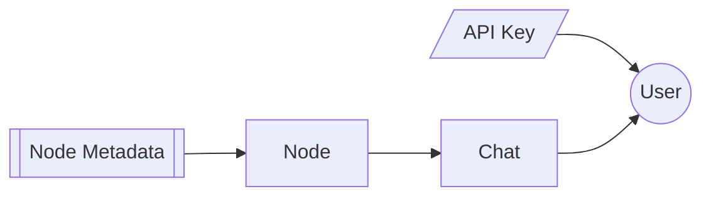

# Sapling

**Sapling is a branching chat app that turns every conversation into a navigable mindmap.**

Unlike linear chat interfaces, Sapling lets you fork any message, keep multiple threads alive simultaneously, and precisely control what context the model sees — so you can explore ideas without losing earlier paths or polluting the model's attention with irrelevant history.

---

## The Problem

When conversations drift — because you explored a tangent, tried a different framing, or the model went in the wrong direction — your only options are to scroll back, start over, or manually stuff context into a new message. There is no way to keep multiple simultaneous lines of reasoning alive or to precisely choose which messages the model should and should not see.

---

## How It Works

Sapling looks like a familiar chatbot, but the real superpower is the **sidebar mindmap**: each message chain is a node path you can revisit and branch from at any time.

- **Fork any message** — branch the conversation from any node and pursue multiple lines of thought independently
- **Spatial navigation** — the mindmap gives conversations a physical location you can learn and return to, rather than relying on scroll position
- **Context control** — Sapling walks up the selected branch and includes ancestor messages until it reaches ~45% of the model's context window, so long conversations never become context soup
- **Model agnostic** — bring your own API key and choose the model per chat or per branch

---

## Features

### Conversation Tree
Every message (user or assistant) is a **node** with a parent pointer, forming an explicit tree. The primary UI is a split view: a chat panel on the left and a zoomable/pannable mindmap on the right. Clicking any node navigates the chat panel to that branch and sets it as the active context for the next message.

### Branch Creation
Any node can be the starting point for a new branch via a fork action. Branches diverge visually in the mindmap; sibling branches are laid out side by side. The active branch is highlighted; inactive branches are visible but dimmed.

### Context Window Management
Before each generation, Sapling computes the token count of the full ancestor path (root → selected node). If it exceeds the configured threshold, Sapling trims from the oldest messages first, preserving the system prompt and the most recent exchanges. A token usage indicator is shown in the input area while composing.

### Node Metadata
Each assistant node records: provider, model, temperature, token count, and any tools invoked. This metadata is visible on hover or in a node detail panel.

### Auth & API Key Management
Users register with email and password. API keys are encrypted at rest and never returned to the client after initial submission — only a masked indicator confirming a key is set.

---

## Data Model

| Table | Purpose |
| ----- | ------- |
| `user` | Account credentials |
| `user_api_key` | One encrypted key per provider per user |
| `chat` | Root container for a conversation tree |
| `node` | A single message; has a `parent_id` forming the tree |
| `node_metadata` | Model, provider, tokens, tools for each assistant node |

---

## Tech Stack

Deno · Fresh · Preact · Hono · TanStack · Drizzle · Turso · Vercel AI SDK · UnoCSS

See [docs/TECH.md](./docs/TECH.md) for the full breakdown with rationale.

---

## Local Development

See [docs/LOCAL.md](./docs/LOCAL.md) for setup instructions.

---

## Terminology

| Term | Definition |
| ---- | ---------- |
| `chat` | Root container for a conversation tree |
| `node` | A single message or checkpoint within a chat |
| `branch` | A path from the root to a leaf node |
| `fork` | The act of creating a new child node from an existing non-leaf node |
| `active branch` | The branch currently selected for display and generation |
| `context path` | The ordered list of ancestor nodes fed to the model for a given generation |

---

## Who It's For

Sapling is designed for individual practitioners — engineers, product managers, researchers, and writers — who use AI assistants heavily and have hit the ceiling of linear chat. The target user is comfortable supplying their own AI API key and values explicit control over the model's context.

**Out of scope (for now):** real-time collaboration, mobile-native apps, voice I/O, fine-tuning or model hosting.
